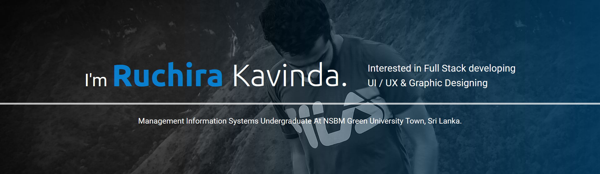

 
 

  

 

 

 

<h3 align="center">I'm Ruchira kavinda. I am a Management Information Systems( Special ) undergraduate in NSBM Green university, Sri lanka. And I'm intersted in Full Stack Development, UI / UX & Graphic Designing.
  

</h3>

&nbsp;

### Languages and Tools 🛠 

### Spotify Playing 🎧

---
